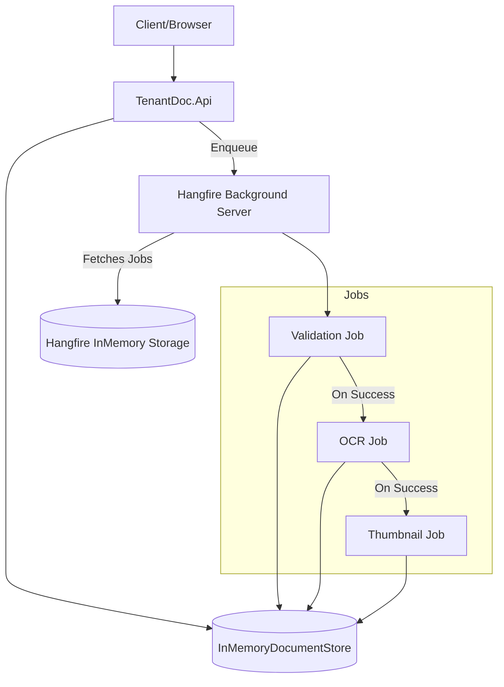

# System Architecture

## 1. Overview
TenantDoc is a distributed-ready background processing system. While currently running in a single process with in-memory storage, the architecture is designed to scale across multiple workers and persistent storage.

## 2. High-Level Diagram



## 3. Data Flow: Document Processing Pipeline

1.  **Ingestion:**
    - API receives a request to `/api/documents/upload`.
    - Document metadata is persisted in `IDocumentStore` with status `Uploaded`.
    - A `ValidationJob` is enqueued as a **Fire-and-forget** job in the `default` queue.

2.  **Validation (Phase 1 & 2):**
    - `ValidationJob` picks up the task.
    - Status changes to `Validating`.
    - File existence and size validation performed.
    - Mock virus scan executed (1-3s delay).
    - If valid (90% success rate), status changes to `OcrPending`.
    - If invalid, status changes to `ValidationFailed`.
    - On success, schedules `OcrJob` with 30-second delay.

3.  **OCR (Phase 2 & 3):**
    - `OcrJob` is scheduled as a **Delayed** job (30s delay) via `IBackgroundJobClient.Schedule()`.
    - Status changes to `OcrProcessing`.
    - File existence verified.
    - Text extraction via `IOcrService` (MockOcrService for now).
    - On success, status becomes `Ready` and `OcrText` is populated.
    - On failure, status becomes `OcrFailed`.
    - Job ID is captured to enable continuation scheduling.

4.  **Thumbnail (Phase 3):**
    - `ThumbnailJob` is scheduled as a **Continuation** via `IBackgroundJobClient.ContinueJobWith()`.
    - Runs only if `OcrJob` completes successfully.
    - Generates 200x200 thumbnail using ImageSharp.
    - Maintains aspect ratio with `ResizeMode.Max`.
    - Saves as JPEG with 80% quality at `{filename}-thumb.jpg`.
    - Updates document with `ThumbnailPath`.

## 4. Job Architecture & Continuation Pattern

### 4.1 Job Scheduling Flow

**Delayed Job Pattern:**
```csharp
var ocrJobId = _jobClient.Schedule<OcrJob>(
    x => x.ProcessOcr(documentId),
    TimeSpan.FromSeconds(30));
```
- Uses `IBackgroundJobClient.Schedule()` to defer execution.
- Returns job ID for downstream continuation tracking.

**Continuation Pattern:**
```csharp
_jobClient.ContinueJobWith<ThumbnailJob>(
    ocrJobId,
    x => x.GenerateThumbnail(documentId));
```
- Scheduled by ValidationJob after capturing OcrJob ID.
- Executes only if parent job (OcrJob) succeeds.
- Dependency injection handled automatically by Hangfire.

### 4.2 Job Components

**OcrJob** (`src/TenantDoc.Api/Jobs/OcrJob.cs`)
- Dependency: `IOcrService`, `IDocumentStore`, `IFileStorageService`
- Verifies file existence before processing
- Updates document status: `OcrProcessing` → `Ready` or `OcrFailed`
- Extracts text and records `ProcessedAt` timestamp

**ThumbnailJob** (`src/TenantDoc.Api/Jobs/ThumbnailJob.cs`)
- Dependency: `IThumbnailService`, `IDocumentStore`, `IFileStorageService`
- Runs as continuation only on OcrJob success
- Generates 200x200 aspect-ratio-preserving thumbnails
- Updates document `ThumbnailPath` property

## 5. Components

### 5.1 Hangfire Dashboard
Accessible at `/hangfire`. Provides real-time visibility into:
- Job queues (default, critical, batch).
- Retries and failures.
- Recurring job schedules.
- Real-time server statistics.

### 5.2 Authorization Filter
`LocalhostAuthorizationFilter` ensures that the sensitive Hangfire dashboard is only accessible from the local machine (or loopback addresses) to prevent unauthorized access in development/testing environments.

### 5.3 Thumbnail Service Implementation
**ImageSharpThumbnailService** (`src/TenantDoc.Infrastructure/Thumbnail/ImageSharpThumbnailService.cs`)
- Uses SixLabors.ImageSharp library for image processing
- Implements `IThumbnailService` interface
- Resizes images maintaining aspect ratio (`ResizeMode.Max`)
- Outputs JPEG format with 80% quality
- Generates thumbnails with `-thumb` suffix in same directory

## 6. Scalability & Resilience
- **Workers:** Hangfire worker count can be adjusted (currently default).
- **Queues:** Designed for multi-tier prioritization (VIP vs Standard).
- **Retries:** Automatic 3-attempt retry with exponential backoff for transient failures.
- **Continuations:** Parent job failure prevents child job execution (fail-fast pattern).
