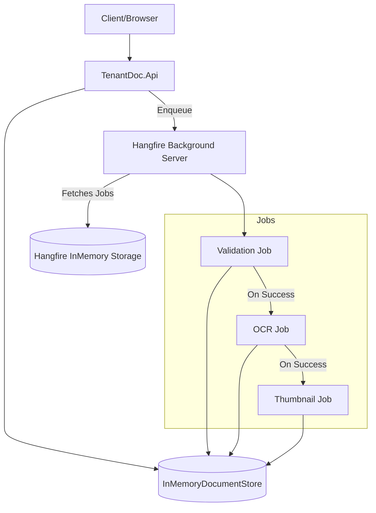

# System Architecture

## 1. Overview
TenantDoc is a distributed-ready background processing system. While currently running in a single process with in-memory storage, the architecture is designed to scale across multiple workers and persistent storage.

## 2. High-Level Diagram

## 3. Data Flow: Document Processing Pipeline

1.  **Ingestion:**
    - API receives a request to `/api/documents/upload`.
    - Document metadata is persisted in `IDocumentStore` with status `Uploaded`.
    - A `ValidationJob` is enqueued as a **Fire-and-forget** job in the `default` queue.

2.  **Validation (Current State):**
    - `ValidationJob` picks up the task.
    - Status changes to `Validating`.
    - Mock validation logic executes.
    - If valid, status changes to `OcrPending`.
    - If invalid, status changes to `ValidationFailed`.

3.  **OCR (Phase 2 & 3):**
    - `OcrJob` is scheduled as a **Delayed** job (30s delay).
    - Status changes to `OcrProcessing`.
    - Text extraction occurs.
    - Success leads to `Ready` status or triggers continuation.

4.  **Thumbnail (Phase 3):**
    - `ThumbnailJob` is triggered as a **Continuation** after successful OCR.
    - Preview image generated and path saved.

## 4. Components

### 4.1 Hangfire Dashboard
Accessible at `/hangfire`. Provides real-time visibility into:
- Job queues (default, critical, batch).
- Retries and failures.
- Recurring job schedules.
- Real-time server statistics.

### 4.2 Authorization Filter
`LocalhostAuthorizationFilter` ensures that the sensitive Hangfire dashboard is only accessible from the local machine (or loopback addresses) to prevent unauthorized access in development/testing environments.

## 5. Scalability & Resilience
- **Workers:** Hangfire worker count can be adjusted (currently default).
- **Queues:** Designed for multi-tier prioritization (VIP vs Standard).
- **Retries:** Automatic 3-attempt retry with exponential backoff for transient failures.
