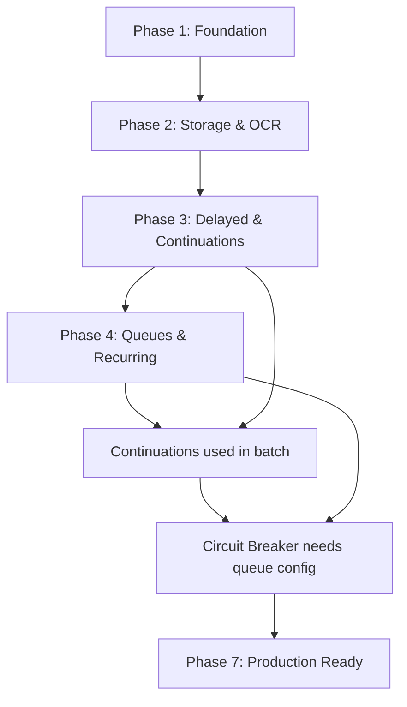

# TenantDoc: Comprehensive Hangfire Learning Project

## Executive Summary

Build a production-grade multi-tenant document processing engine to master all Hangfire features through real-world patterns: fire-forget/delayed/recurring/continuation/batch jobs, queue prioritization, custom filters, retry policies, circuit breakers, and dead letter queues.

**Tech Stack:** .NET 10, ASP.NET Core Minimal APIs, Hangfire.InMemory → SQL Server, Tesseract OCR, ImageSharp  
**Timeline:** 7 days (40 hours)  
**Complexity:** Advanced (real-world patterns without production overhead)

---

## Architecture Overview

```
Multi-Tenant Document Processing Pipeline

Upload → ValidationJob (fire-forget) → OcrJob (delayed 30s) → ThumbnailJob (continuation)
           ↓                              ↓                        ↓
      [default queue]              [critical/default/batch]   [default queue]
           ↓                              ↓                        ↓
    Retry 3x (exp backoff)         Circuit breaker         Update status
           ↓                              ↓                        ↓
    Dead letter queue             Pause on failures        Webhook notify

Recurring Jobs:
- Daily cleanup (files >24hrs)
- Hourly usage reports per tenant
- Metrics aggregation

Custom Filters:
- TenantIsolationFilter (context propagation)
- MetricsFilter (duration, success rate)
- DeadLetterFilter (failed job routing)
- CircuitBreakerFilter (OCR service protection)
```

---

## Implementation Phases

| Phase | Day | Duration | Focus | Status | Link |
|-------|-----|----------|-------|--------|------|
| **Phase 1** | 1 | 6h | Foundation & Project Setup | DONE (2026-01-22) | [View Details](phases/phase-1.md) |
| **Phase 2** | 2 | 6h | Document Storage & Tesseract OCR | Pending | [View Details](phases/phase-2.md) |
| **Phase 3** | 3 | 6h | Delayed Jobs & Continuations | Pending | [View Details](phases/phase-3.md) |
| **Phase 4** | 4 | 7h | Queue System & Recurring Jobs | Pending | [View Details](phases/phase-4.md) |
| **Phase 5** | 5 | 7h | Batch Processing | Pending | [View Details](phases/phase-5.md) |
| **Phase 6** | 6 | 7h | Advanced Error Handling & Filters | Pending | [View Details](phases/phase-6.md) |
| **Phase 7** | 7 | 7h | Production Readiness & Testing | Pending | [View Details](phases/phase-7.md) |

---

## Phase Summaries

### [Phase 1: Foundation & Project Setup](phases/phase-1.md) (Day 1, 6h)
- ✅ Create .NET 10 solution structure (3 projects)
- ✅ Install and configure Hangfire.InMemory
- ✅ Setup Hangfire dashboard at `/hangfire`
- ✅ Define core domain models
- ✅ Implement first fire-and-forget ValidationJob

**Key Learning:** Hangfire basics, job enqueueing, dashboard monitoring

---

### [Phase 2: Document Storage & Tesseract OCR](phases/phase-2.md) (Day 2, 6h)
- ✅ Implement local file storage service
- ✅ Build real file upload endpoint (PDF/PNG/JPG)
- ✅ Integrate Tesseract OCR (with mock fallback)
- ✅ Update ValidationJob with real file logic

**Key Learning:** External service integration, error handling

---

### [Phase 3: Delayed Jobs & Continuations](phases/phase-3.md) (Day 3, 6h)
- ✅ Create OcrJob with 30-second delayed execution
- ✅ Implement thumbnail generation service (ImageSharp)
- ✅ Build ThumbnailJob as continuation
- ✅ Test end-to-end pipeline (upload → validate → OCR → thumbnail)

**Key Learning:** Delayed scheduling, job continuations, pipeline orchestration

---

### [Phase 4: Queue System & Recurring Jobs](phases/phase-4.md) (Day 4, 7h)
- ✅ Configure 3-tier queue system (critical/default/batch)
- ✅ Implement tenant-based queue routing (VIP → critical)
- ✅ Create recurring cleanup job (daily at 2 AM)
- ✅ Build hourly usage report job
- ✅ Test queue priority behavior

**Key Learning:** Queue prioritization, worker allocation, recurring jobs

---

### [Phase 5: Batch Processing](phases/phase-5.md) (Day 5, 7h)
- ✅ Setup Hangfire.Pro batch support (or custom alternative)
- ✅ Build bulk upload endpoint
- ✅ Implement BatchProcessingJob with atomic processing
- ✅ Handle partial failures in batches
- ✅ Performance test with 100-document batch

**Key Learning:** Batch atomicity, continuation patterns, performance optimization

---

### [Phase 6: Advanced Error Handling & Custom Filters](phases/phase-6.md) (Day 6, 7h)
- ✅ Configure exponential backoff retry policy (0s, 2s, 8s)
- ✅ Implement dead letter queue filter
- ✅ Build circuit breaker for OCR service
- ✅ Create tenant isolation filter
- ✅ Add metrics collection filter

**Key Learning:** Retry strategies, circuit breaker pattern, custom filters

---

### [Phase 7: Production Readiness & Testing](phases/phase-7.md) (Day 7, 7h)
- ✅ Implement graceful shutdown
- ✅ Add job cancellation token support
- ✅ Performance testing (1000 documents)
- ✅ Write unit & integration tests (80%+ coverage)
- ✅ Optional: SQL Server migration

**Key Learning:** Production patterns, testing strategies, persistence migration

---

## Cross-Phase Dependencies



---

## Success Criteria (Overall Project)

### Must Have (Critical)
- ✅ All 5 job types working: fire-forget, delayed, recurring, continuation, batch
- ✅ 3-tier queue system with observable priority (critical > default > batch)
- ✅ Retry policy: exponential backoff, 3 attempts
- ✅ Dead letter queue pattern implemented
- ✅ Batch processing: 10+ documents atomically
- ✅ Dashboard accessible, all jobs visible

### Should Have (Important)
- ✅ Custom filters: tenant isolation, metrics, dead letter, circuit breaker
- ✅ Circuit breaker pauses OCR jobs on failures
- ✅ Graceful shutdown tested (no job loss)
- ✅ Unit tests for job logic (80%+ coverage)
- ✅ Tesseract OCR working with real images
- ✅ End-to-end pipeline: upload → validate → OCR → thumbnail

### Nice to Have (Optional)
- ⚪ SQL Server persistence configured
- ⚪ Multi-server distributed setup (2+ servers)
- ⚪ Job progress reporting (`IJobCancellationToken`)
- ⚪ Custom dashboard widgets (tenant metrics)
- ⚪ Docker containerization
- ⚪ 1000+ document load test

---

## Technical Risks & Mitigations Summary

| Risk | Impact | Phase | Mitigation |
|------|--------|-------|------------|
| Tesseract setup fails | High | 2 | Mock OCR service fallback, swap later |
| Hangfire.Pro trial expires | Medium | 5 | Custom batch tracking implementation |
| In-memory storage resets | Low | All | Document limitation, SQL Server migration in Phase 7 |
| Circuit breaker false positives | Medium | 6 | Tune thresholds, manual override endpoint |
| Large file uploads slow API | Low | 2 | Document streaming pattern for production |
| SQL Server setup complexity | Medium | 7 | Use LocalDB, skip if time constrained |
| Worker allocation not proportional | Low | 4 | Document actual behavior, adjust WorkerCount |
| Continuation jobs not triggering | Medium | 3 | Verify Hangfire version, check API usage |

---

## Learning Outcomes Checklist

By project completion, you will master:

### Hangfire Fundamentals
- ✅ Job enqueueing mechanisms (fire-forget, delayed, recurring)
- ✅ Job lifecycle states (enqueued, processing, succeeded, failed, scheduled)
- ✅ Dashboard monitoring and manual interventions
- ✅ Storage abstraction (in-memory vs persistent)

### Advanced Patterns
- ✅ Queue-based job prioritization (multi-tier queues)
- ✅ Batch job atomicity and continuations
- ✅ Custom filters for cross-cutting concerns
- ✅ Retry policies and failure handling strategies
- ✅ Circuit breaker pattern for external dependencies
- ✅ Dead letter queue for manual intervention

### Production Readiness
- ✅ Graceful shutdown and job cancellation
- ✅ Tenant isolation in multi-tenant systems
- ✅ Performance characteristics (1000s of jobs)
- ✅ Testing strategies for background jobs
- ✅ Migration from in-memory to persistent storage

---

## Development Environment Setup

### Prerequisites
- .NET 10 SDK (latest)
- Visual Studio 2024 / VS Code / Rider
- Git
- Optional: SQL Server Express / LocalDB (Phase 7)
- Optional: Docker (for SQL Server container)

### Initial Setup Commands
```bash
# Clone repository (or create new)
git init TenantDoc
cd TenantDoc

# Create solution
dotnet new sln -n TenantDoc

# Create projects
dotnet new webapi -n TenantDoc.Api -framework net10.0 --use-minimal-apis
dotnet new classlib -n TenantDoc.Core -framework net10.0
dotnet new classlib -n TenantDoc.Infrastructure -framework net10.0
dotnet new xunit -n TenantDoc.Tests.Unit -framework net10.0
dotnet new xunit -n TenantDoc.Tests.Integration -framework net10.0

# Add projects to solution
dotnet sln add src/TenantDoc.Api
dotnet sln add src/TenantDoc.Core
dotnet sln add src/TenantDoc.Infrastructure
dotnet sln add tests/TenantDoc.Tests.Unit
dotnet sln add tests/TenantDoc.Tests.Integration

# Add project references
dotnet add src/TenantDoc.Api reference src/TenantDoc.Core
dotnet add src/TenantDoc.Api reference src/TenantDoc.Infrastructure
dotnet add src/TenantDoc.Infrastructure reference src/TenantDoc.Core

# Install Hangfire packages
cd src/TenantDoc.Api
dotnet add package Hangfire.Core
dotnet add package Hangfire.AspNetCore
dotnet add package Hangfire.InMemory

# Verify build
dotnet build
```

---

## Configuration Reference

### Queue Configuration
```csharp
options.Queues = new[] { "critical", "default", "batch" };
options.WorkerCount = 7; // Distributed: critical=4, default=2, batch=1
```

### Retry Policy
```csharp
[AutomaticRetry(Attempts = 3, DelaysInSeconds = new int[] { 0, 2, 8 })]
```

### Recurring Jobs
```csharp
// Daily cleanup at 2 AM UTC
RecurringJob.AddOrUpdate<CleanupJob>(
    "daily-cleanup",
    x => x.CleanupOldDocuments(),
    "0 2 * * *",
    new RecurringJobOptions { TimeZone = TimeZoneInfo.Utc, Queue = "batch" });

// Hourly usage reports
RecurringJob.AddOrUpdate<UsageReportJob>(
    "hourly-usage-report",
    x => x.GenerateHourlyReport(),
    "0 * * * *",
    new RecurringJobOptions { Queue = "batch" });
```

### Circuit Breaker Thresholds
- **Failure rate threshold:** 50% (5 out of 10 jobs)
- **Window size:** 10 jobs (sliding)
- **Open duration:** 5 minutes
- **Auto-close:** After timeout

---

## Next Steps

1. **Review this plan** with stakeholders/mentors
2. **Setup development environment** (prerequisites, project structure)
3. **Begin Phase 1** → [Foundation & Project Setup](phases/phase-1.md)
4. **Daily check-ins** after each phase completion
5. **Code review** after Phase 4 (foundation complete)
6. **Final review** after Phase 7 (production readiness)
7. **Documentation** update throughout (README, architecture docs)

---

## Additional Resources

### Hangfire Documentation
- Official docs: https://docs.hangfire.io/
- Hangfire.Pro: https://www.hangfire.io/pro/
- GitHub: https://github.com/HangfireIO/Hangfire

### Tesseract OCR
- Tesseract wrapper: https://github.com/charlesw/tesseract
- Tessdata files: https://github.com/tesseract-ocr/tessdata

### ImageSharp
- Docs: https://docs.sixlabors.com/
- GitHub: https://github.com/SixLabors/ImageSharp

### Testing
- xUnit: https://xunit.net/
- Moq: https://github.com/moq/moq4
- FluentAssertions: https://fluentassertions.com/

---

**Plan Created:** 2026-01-22  
**Estimated Completion:** 2026-01-29 (7 days, 40 hours)  
**Complexity Level:** Advanced  
**Primary Learning Goal:** Master all Hangfire features through real-world patterns
